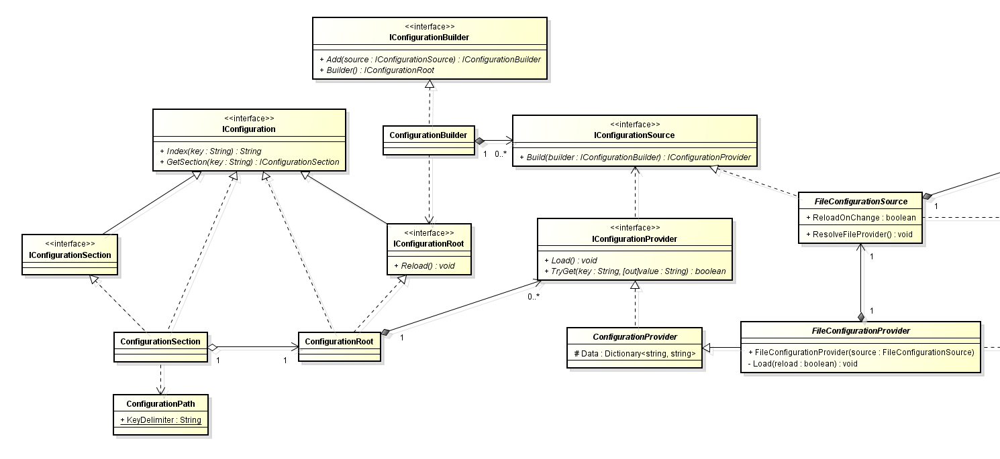

# ASP.net 配置管理设计

Configuration Managemnet Implement in ASP.Net Core.
<!--more-->

Configuration Management Features
- Manage different kind of multiple configuration sources.
- Easy to config for different environments, such as dev, release.
- Bind configuration values into Decoupled Configuration Class.
- Reload Configurations when configuration updates.

## Configuration Management in ASP.Net Core
Essential packages

- Microsoft.Extensions.Configuration.Abstractions, 
define essential interfaces for configuration management.
- Microsoft.Extensions.Configuration, basic implement of interfaces 
in Microsoft.Extensions.Configuration.Abstractions
- Microsoft.Extensions.Configuration.Binder, 
use reflect to convert configurations into decoupled configuration class.

**IConfiguration**

Provides friendly common interfaces for users to get configuration.

It manages multiple configuration providers.

**IConfigurationProvider**

It contains configuration data in memory which loaded from configuration source.

**IConfigurationSource**

It's a representation of configuration source 
and used to build provider.

Also it used to watch update of source, 
when update notify provider to reload data from source.

**Configuration Class Bind**

It should always get a copy of data 
from configuration provider for configuration class.
It makes thead-safe.

## Reference

- [Interface Segregation Principle](http://deviq.com/interface-segregation-principle/)
- [Separation of Concerns](http://deviq.com/separation-of-concerns/)
- [Builder pattern](https://en.wikipedia.org/wiki/Builder_pattern)

---
[Configuration in ASP.Net Core]: https://docs.microsoft.com/en-us/aspnet/core/fundamentals/configuration
